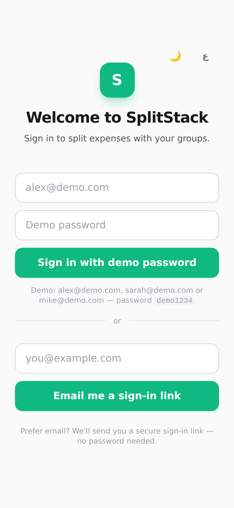
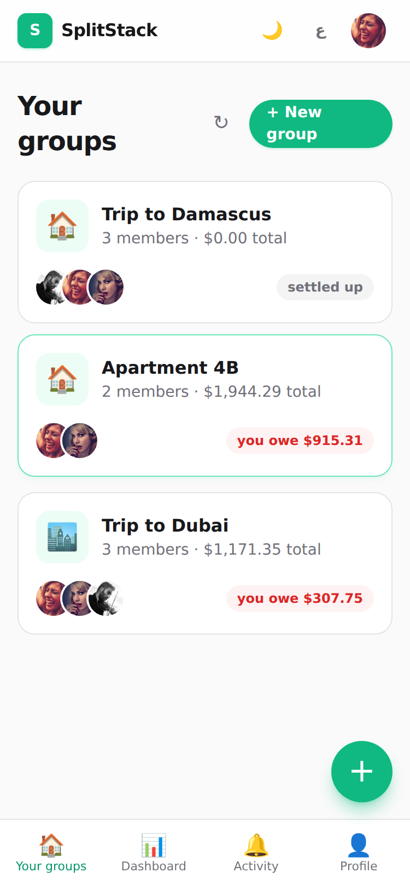
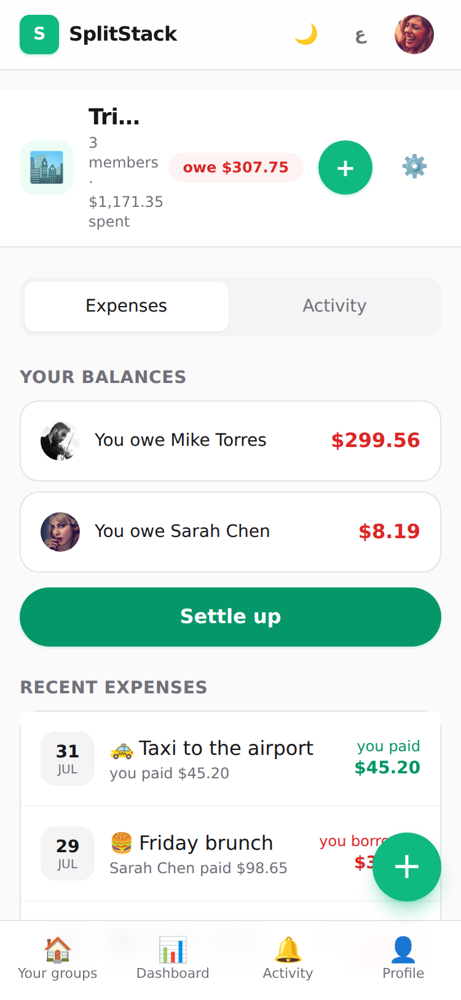
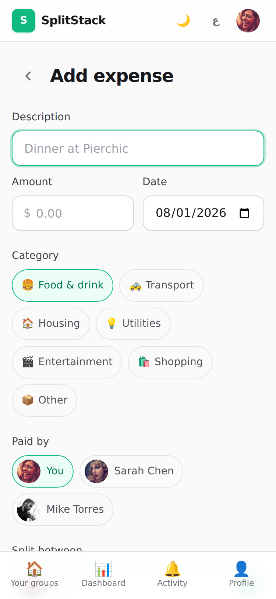
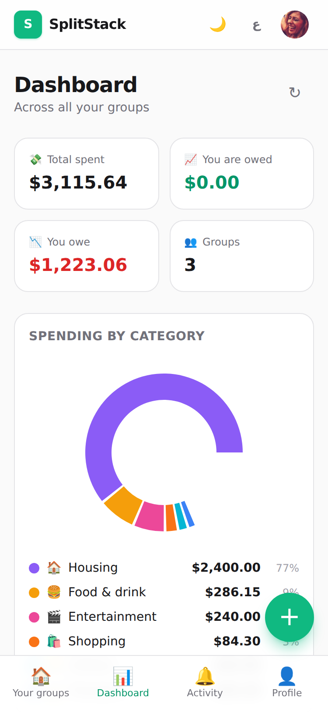
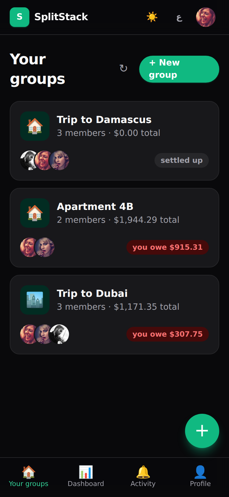
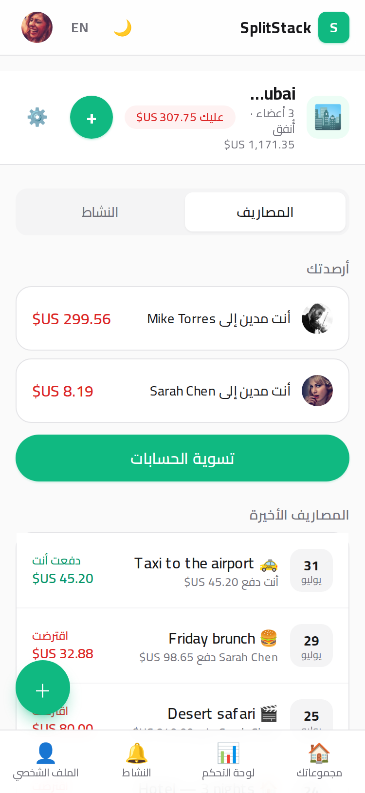
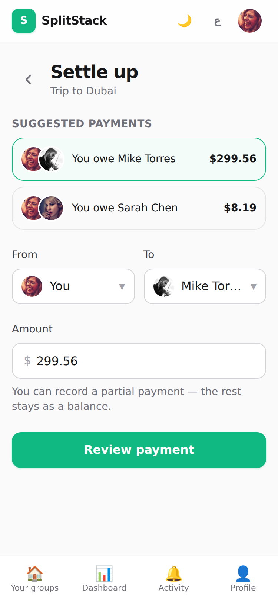

# SplitStack

> Split expenses with friends, simplify debts, and settle up — a mobile-first PWA inspired by Splitwise.

**🔗 Live demo:** https://splitstack.vercel.app _(update after deployment)_
**Demo login:** `alex@demo.com` · `sarah@demo.com` · `mike@demo.com` — password `demo1234`

---

## Screenshots

| Login | Home (groups) | Group dashboard | Add expense |
| ----- | ------------- | --------------- | ----------- |
|  |  |  |  |

| Analytics | Dark mode | Arabic (RTL) | Settle up |
| --------- | --------- | ------------ | --------- |
|  |  |  |  |

**GIF demo:** 

> Capture shots at 375px (iPhone) — see `docs/screenshots/README.md` for the exact checklist.

## Features

- **Groups** — create groups, invite members by email (pending invites auto-claim on first sign-in), rename, leave (only when settled), admin-only delete
- **Expenses** — description, amount, date, category, payer, participants; three split modes:
  - **Equally** — deterministic rounding, remainder cents go to the payer first
  - **Exact amounts** — validated to sum exactly to the total
  - **Percentages** — validated to sum to 100
- **Balance engine** — per-member net balances derived from splits + settlements; **debt simplification** produces the minimal transfer set (greedy largest-debtor ↔ largest-creditor)
- **Settle up** — suggested payments, partial payments, two-step confirmation sheet
- **Analytics dashboard** — totals, category donut, 6-month spending bars (recharts)
- **Activity feed** — global and per-group, with relative timestamps
- **PWA** — installable, offline fallback page, service worker caching, maskable icons, safe-area insets
- **Mobile-first UX** — bottom nav, FAB with group picker, bottom sheets, swipe-to-reveal edit/delete, 44px+ touch targets, sticky headers, loading skeletons
- **i18n** — English + Arabic with full RTL layout and Cairo font; locale-aware currency and dates
- **Dark mode** — system default with manual toggle
- **Auth** — Google OAuth, email magic links (no passwords), plus a mocked demo email+password login for reviewers

## Tech stack

| Layer | Choice |
| --- | --- |
| Framework | Next.js 14 (App Router), React 18, TypeScript strict |
| Styling | Tailwind CSS (mobile-first, `darkMode: 'class'`, logical properties for RTL) |
| Database | PostgreSQL (Neon) + Prisma ORM — money as `Decimal(12,2)` |
| Auth | Auth.js v5 (next-auth beta) — Google, nodemailer magic links, credentials demo |
| Mutations | Server Actions + Zod validation, typed results |
| Forms | React Hook Form + Zod |
| i18n | next-intl (cookie locale, En/Ar, RTL) |
| Charts | recharts |
| PWA | @ducanh2912/next-pwa (Workbox), hand-rolled PNG icon generator |
| Tests | Vitest — 31 unit tests for the money/balance engine |
| Deploy | Vercel |

## Getting started

**Prerequisites:** Node 20+, a PostgreSQL database (free [Neon](https://neon.tech) or Supabase works).

```bash
npm install
cp .env.example .env   # fill in values (see below)
npx prisma migrate dev --name init
npm run db:seed        # 3 users, 2 groups, realistic expenses
npm run dev
```

### Environment variables

| Variable | Required | Notes |
| --- | --- | --- |
| `DATABASE_URL` | ✅ | Postgres connection string |
| `AUTH_SECRET` | ✅ | `npx auth secret` |
| `DEMO_PASSWORD` | ➖ | Shared password for the mocked demo login (default `demo1234`) |
| `AUTH_GOOGLE_ID` / `AUTH_GOOGLE_SECRET` | ➖ | Enables the Google button when set |
| `EMAIL_SERVER` / `EMAIL_FROM` | ➖ | SMTP for real magic links; without it, links print to the server console |

### Scripts

| Command | Purpose |
| --- | --- |
| `npm run dev` | Dev server (PWA disabled in dev) |
| `npm run build` | `prisma generate` + production build |
| `npm test` | Vitest unit tests |
| `npm run db:seed` | Idempotent demo seed |
| `npm run lint` / `npm run format` | ESLint / Prettier |
| `npm run icons:generate` | Regenerate PWA icons (no dependencies) |

## Architecture notes

### Money

All money is handled as **integer cents** in app code (`lib/money.ts`). Prisma stores `Decimal(12,2)` — never floats — and conversion happens through `decimalToCents` / `centsToDecimal`. Formatting happens only at display time via `Intl.NumberFormat` with the active locale (USD).

### Balances

Balances are **derived, never stored**. `computeNetBalances(memberIds, expenses, settlements)` in `lib/balance.ts`:

- paying an expense credits you its full amount
- each split debits the share owed
- a settlement credits the payer (debtor) and debits the recipient (creditor)

Sign convention: **positive = the user is owed money, negative = they owe**. The group always nets to zero, which the tests verify.

### Debt simplification

`simplifyDebts(balances)` greedily matches the **largest debtor with the largest creditor**, producing at most _n−1_ transfers that settle every account — e.g. "A owes B, B owes C" collapses to a single "A pays C" transfer. Edge cases (3-way chains, circular debts, zero balances, rounding remainders) are covered by unit tests in `lib/balance.test.ts`.

### Authorization

Every Server Action re-checks the session **and** group membership (`ACTIVE` status) before mutating; data queries are membership-scoped at the Prisma level, so users can only ever read groups they belong to.

### Auth & invites

Auth.js v5 with the Prisma adapter, JWT sessions. Inviting an unknown email creates a placeholder `User` + `PENDING` membership; Auth.js links the first OAuth/magic-link sign-in to that row by email, and a `signIn` event flips the membership to `ACTIVE`. The demo credentials provider unlocks existing (seeded) users with a shared password — handy for reviewers on the deployed app.

### i18n / RTL

next-intl with a cookie-based locale (no URL segments). `<html dir>` flips for Arabic, CSS uses logical properties (`ms-/me-/ps-/pe-`), directional icons mirror via `rtl:-scale-x-100`, and Cairo is applied only under `html[lang="ar"]`.

## Deployment (Vercel)

1. Push the repo to GitHub and **Import** it in Vercel (or run `npx vercel`).
2. Set env vars: `DATABASE_URL`, `AUTH_SECRET`, `DEMO_PASSWORD`, and optionally Google/SMTP values.
3. Deploy — the build command already runs `prisma generate`. Apply migrations to your production DB once from your machine:
   ```bash
   DATABASE_URL="<prod-url>" npx prisma migrate deploy
   DATABASE_URL="<prod-url>" npm run db:seed   # optional demo data
   ```
4. Sign in with the demo credentials above.

## Future improvements

- Multi-currency support with per-group currency + FX conversion
- Receipt OCR for expense entry
- Push notifications (Web Push) for new expenses and settlements
- Recurring expenses (rent, subscriptions)
- Expense comments and attachments
- CSV/PDF export per group
- Real email invites (the infrastructure is ready — just add SMTP)
